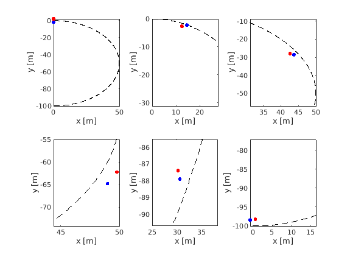

# autonomous_racing
- ROS package for autonomous racing using optimal control
- Contains ROS nodes to run high level planner and low level tracking controller together

## Description:
### High level:
- `pdgplanner.py` is the high-level planner class of the Ego vehicle
- `aiagent.py` contains competing AI agent class
- `high_level_node` is the ROS node calling these classes

### Low Level:
- `tracking_MPC_allConstr.mexa64` is the the controller compiled from ACADO Toolkit
- `nlmpc_autorace_sim_allConstr.m` is the low level control simulation ros node

## Key dependencies:
- `pdgplanner.py` should be in the same directory as `ilqr/` folder. ilqr code is used from https://github.com/anassinator/ilqr
- `aiagent.py` requires Casadi in the appended path
- ROS 
- MATLAB
- Python 2.7
- Numpy 
- Theanos
- ACADO toolkit for MATLAB (https://acado.github.io/matlab_overview.html)
- ROS Toolbox from MATLAB

## Instructions to run:

```bash
$ cd ~/catkin_ws/src
$ git clone https://github.com/pgupta2050/autonomous_racing.git
$ roscore
$ rosrun autonomous_racing high_level_node.py
```
Then run the MATLAB file [nlmpc_autorace_sim_allConstr](https://github.com/pgupta2050/autonomous_racing/blob/main/src/low_level/nlmpc_autorace_sim_allConstr.m)

## Simulation result for a circular track with 1 competing agent


*Time snaps: ego in blue and competitor in red*

## Contributors:
- [Viranjan Bhattcharyya](https://github.com/autonomous-viranjan)
- [Jacky Tang](https://github.com/jackyt22)
- Prakhar Gupta
